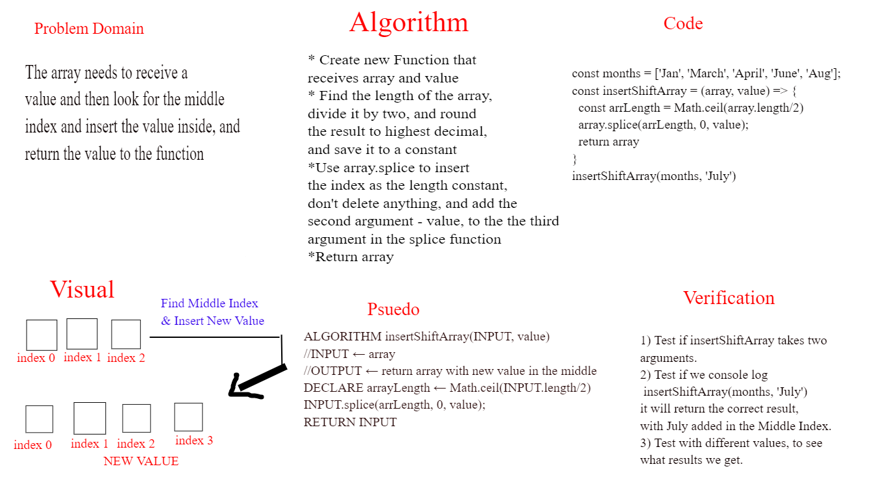

# Insert to Middle of an Array
Write a function called insertShiftArray which takes in an array and a value to be added. Without utilizing any of the built-in methods available to your language, return an array with the new value added at the middle index.

## Whiteboard Process

## Approach & Efficiency
I used the Problem solving, Visual, Algorithm, Psuedo, Code, Verification approach respectively to map out the way to to solve the issue at hand.

Big O moment when I went back to the psuedocode in order to add the 
INPUT instead of the array.