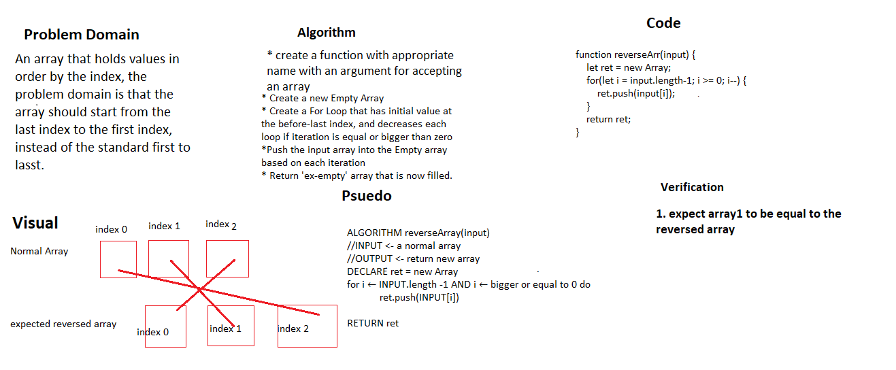

# Reverse an Array
Write a function called reverseArray which takes an array as an argument. Without utilizing any of the built-in methods available to your language, return an array with elements in reversed order.

## Whiteboard Process

## Approach & Efficiency
<!-- What approach did you take? Discuss Why. What is the Big O space/time for this approach? -->

I first looked at the array, and looked for functions and methods in order to be able to reverse, and then displayed it in a console.log.

The Big O time for this approach is quick as the code will be going through the tasks at once.
