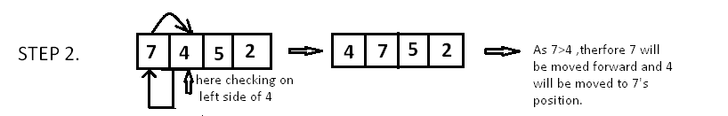
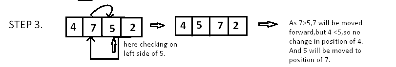
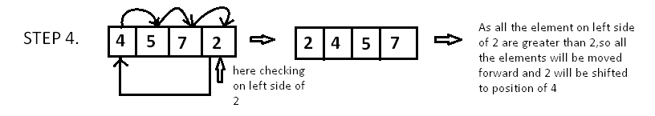

##  Insertion-sort:
 
Insertion sort is a simple sorting algorithm that works similar to the way you sort playing cards in your hands. The array is virtually split into a sorted and an unsorted part. Values from the unsorted part are picked and placed at the correct position in the sorted part.

There are not elements on the left side of 7, therefore it wont change

The 4 will be moved to the left before the 7 since it's smaller in value

The 5 will be compared to 7 and therefore moved to the left, however when compared to 4 it will stay in it's place.

The 2 will be compared to each value to the left and on every instance its found that its lower than the first value, and therefore it takes its place.

