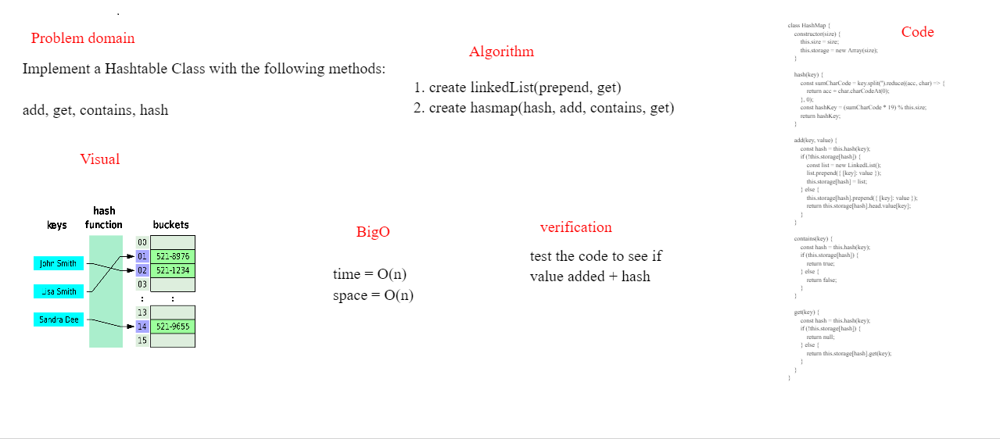

# hasmap repeated word
Implement a Hashtable Class with the following methods:

add
Arguments: key, value
Returns: nothing
This method should hash the key, and add the key and value pair to the table, handling collisions as needed.
get
Arguments: key
Returns: Value associated with that key in the table
contains
Arguments: key
Returns: Boolean, indicating if the key exists in the table already.
hash
Arguments: key
Returns: Index in the collection for that key

## Challenge
add to the hashtable and retrieve

## Approach & Efficiency
time = O(n)
space = O(n)s

