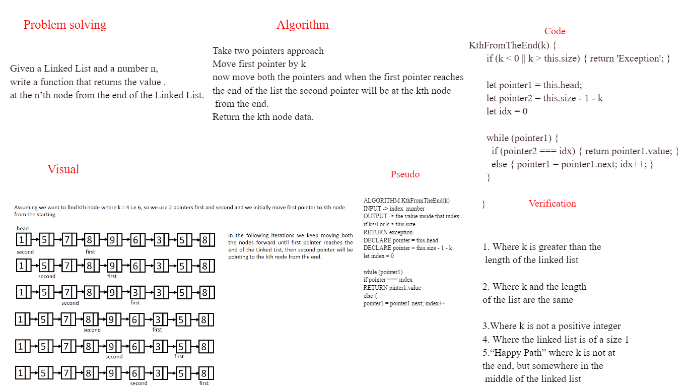

# Challenge Type: Extending an Implementation

Given a Linked List and a number n, 
write a function that returns the value .
at the n’th node from the end of the Linked List.

Where k is greater than the length of the linked list
Where k and the length of the list are the same
Where k is not a positive integer
Where the linked list is of a size 1
“Happy Path” where k is not at the end, but somewhere in the middle of the linked list

## Whiteboard Process

## Approach & Efficiency
I used the Problem solving, Visual, Algorithm, Psuedo, Code, Verification approach respectively to map out the way to to solve the issue at hand.

Big O moment when I went back to the psuedocode in order to add the 
INPUT instead of the array.