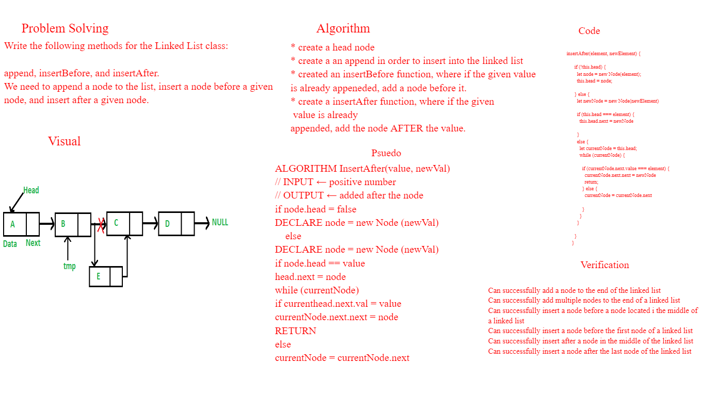

# Challenge Type: Extending an Implementation

Feature Tasks
Write the following methods for the Linked List class:

append
arguments: new value
adds a new node with the given value to the end of the list
insert before
arguments: value, new value
adds a new node with the given new value immediately before the first node that has the value specified
insert after
arguments: value, new value
adds a new node with the given new value immediately after the first node that has the value specified

## Whiteboard Process

## Approach & Efficiency
I used the Problem solving, Visual, Algorithm, Psuedo, Code, Verification approach respectively to map out the way to to solve the issue at hand.

Big O moment when I went back to the psuedocode in order to add the 
INPUT instead of the array.