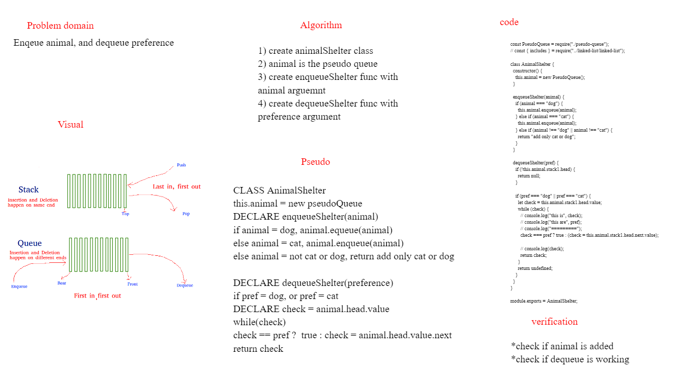

# Challenge Summary
Feature Tasks
Create a class called AnimalShelter which holds only dogs and cats.
The shelter operates using a first-in, first-out approach.
Implement the following methods:
enqueue
Arguments: animal
animal can be either a dog or a cat object.
dequeue
Arguments: pref
pref can be either "dog" or "cat"
Return: either a dog or a cat, based on preference.
If pref is not "dog" or "cat" then return null.

## Whiteboard Process

##  Approach & Efficiency
Method 1 (By making enQueue operation costly) This method makes sure that oldest entered element is always at the top of stack 1, so that deQueue operation just pops from stack1. To put the element at top of stack1, stack2 is used.

While stack1 is not empty, push everything from stack1 to stack2.
Push x to stack1 (assuming size of stacks is unlimited).
Push everything back to stack1.
Here time complexity will be O(n)

deQueue(q): 

If stack1 is empty then error
Pop an item from stack1 and return it
Here time complexity will be O(1)