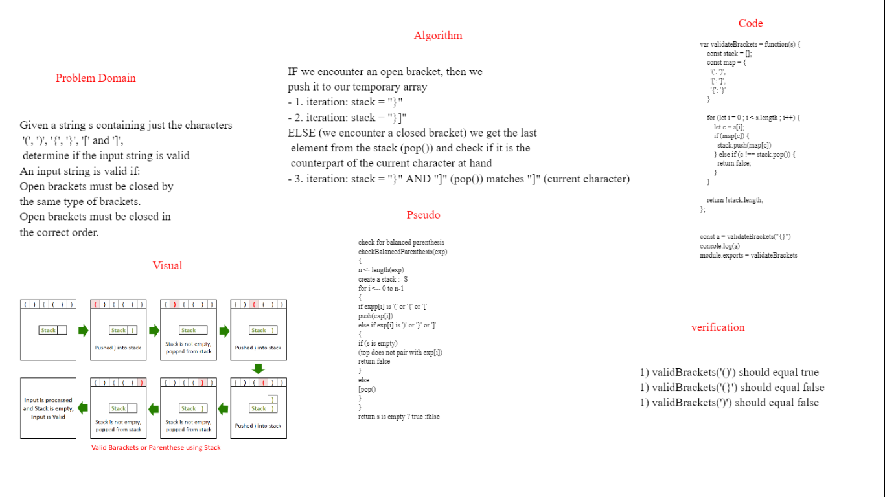

# Challenge Summary

Given a string s containing just the characters
 '(', ')', '{', '}', '[' and ']',
 determine if the input string is valid
An input string is valid if:
Open brackets must be closed by 
the same type of brackets.
Open brackets must be closed in 
the correct order.

## Whiteboard Process

##  Approach & Efficiency
IF we encounter an open bracket, then we 
push it to our temporary array
- 1. iteration: stack = "}"
- 2. iteration: stack = "}]"
ELSE (we encounter a closed bracket) we get the last
 element from the stack (pop()) and check if it is the
 counterpart of the current character at hand
- 3. iteration: stack = "}" AND "]" (pop()) matches "]" (current character)