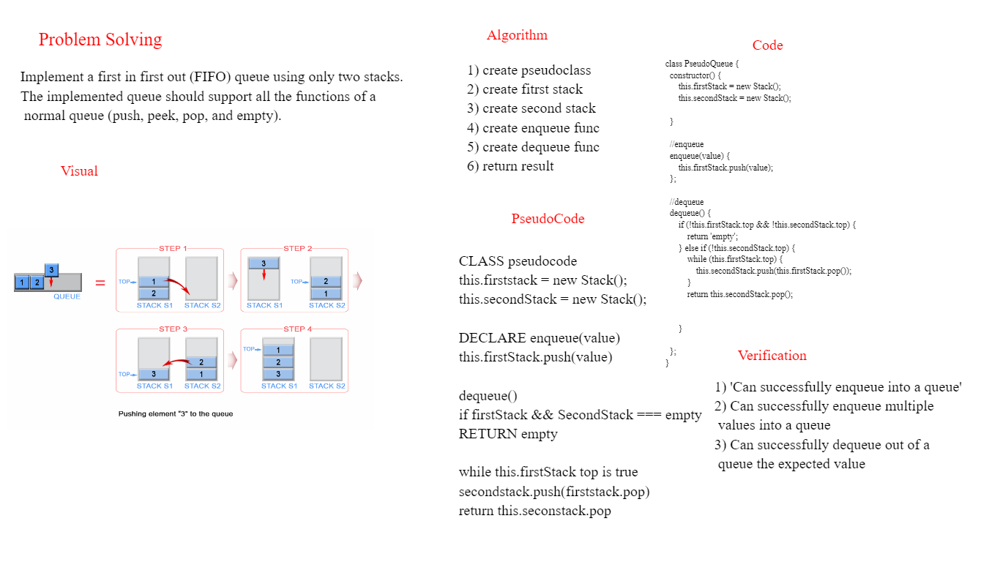

# Challenge Summary
Create a new class called pseudo queue.
Do not use an existing Queue.
Instead, this PseudoQueue class will implement our standard queue interface (the two methods listed below),
Internally, utilize 2 Stack instances to create and manage the queue
Methods:
enqueue
Arguments: value
Inserts value into the PseudoQueue, using a first-in, first-out approach.
dequeue
Arguments: none

## Whiteboard Process

##  Approach & Efficiency
Method 1 (By making enQueue operation costly) This method makes sure that oldest entered element is always at the top of stack 1, so that deQueue operation just pops from stack1. To put the element at top of stack1, stack2 is used.

While stack1 is not empty, push everything from stack1 to stack2.
Push x to stack1 (assuming size of stacks is unlimited).
Push everything back to stack1.
Here time complexity will be O(n)

deQueue(q): 

If stack1 is empty then error
Pop an item from stack1 and return it
Here time complexity will be O(1)