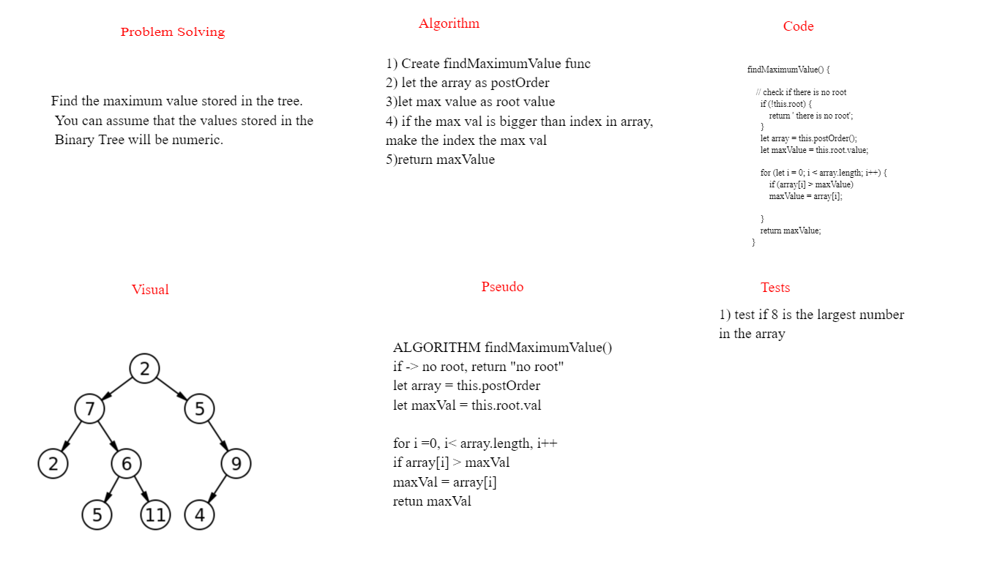

# Challenge Summary

Write the following method for the Binary Tree class

find maximum value
Arguments: none
Returns: number
Find the maximum value stored in the tree. You can assume that the values stored in the Binary Tree will be numeric.

## Whiteboard Process

##  Approach & Efficiency
In Binary Search Tree, we can find maximum by traversing right pointers until we reach the rightmost node. But in Binary Tree, we must visit every node to figure out maximum. So the idea is to traverse the given tree and for every node return maximum of 3 values. 

Node’s data.
Maximum in node’s left subtree.
Maximum in node’s right subtree.